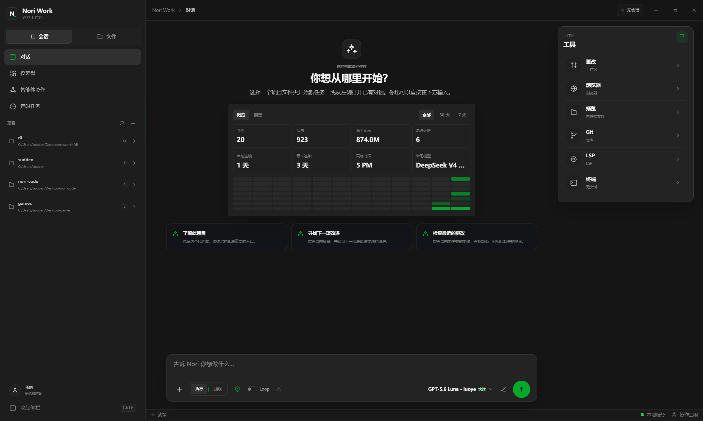
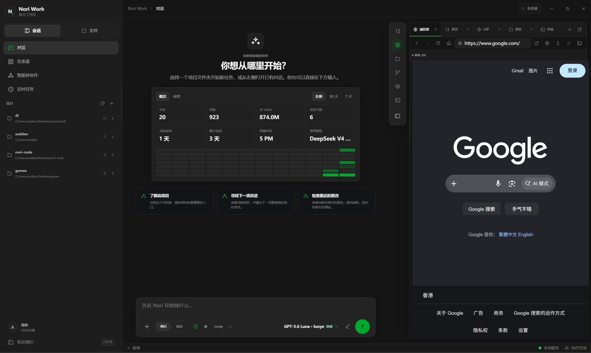

# Nori Code / Nori Work

> **Early project.** What ships today is **Team Engineering**: a durable department tree, Discuss before Assign, and a conversation map linked by `parent_session_id`. The deleted SubAgent DAG is **not** the product.

Nori is a coding-agent workspace forked from [Kimi Code CLI](https://github.com/MoonshotAI/kimi-code) (MIT). Nori Code is the terminal CLI/TUI; Nori Work is the Electron desktop. Like Codex and Claude Code, it can read and edit files, run a shell, and connect MCP. Unlike them, handing work to another agent means hiring a **standing department**, not spawning a disposable fan-out.

[中文说明](README.zh-CN.md)





> [!NOTE]
> Current delegation is documented in [CHANGELOG.md](CHANGELOG.md) under `v2.0.0`. Fixes since that release are under `v2.0.1`. Older entries that describe SubAgent, DAG orchestration, or `nori_swarm_launch` are historical.

---

## 1. What Nori is now

**Team Engineering** is the **only** way Nori hands work to another agent. The temporary `SubAgent` tool, the `'sub'` node kind, and the TUI subagent chrome are gone. Changelog rationale: two spawn paths meant two answers to “who is working right now”; more importantly, throwaway children that report only at `done` are fan-out, not a team. The failure mode this exists to prevent is silent parallel work.

### A department tree, not a task pool

- Any agent may hire members with `TeamCreate` and chair its own department, bounded by `team.maxDepth` (default `2`, maximum `5`).
- A Discuss round is one department: a parent plus its direct members. A node never chairs and participates at the same time.
- Hiring uses the same path as the conversation map: create a **real child session**, mount it with `parent_session_id`, and show it as a session card. Work, tools, sibling chat, and identity live on that child session. Discuss/Assign address the session id (or display name).
- `TeamDismiss` removes a member and **deletes** that child session. Unmount on the map is a user action: detach without deleting. A session has one parent; part-time / second-parent hire is not supported.

### Discuss, then Code

Typical flow:

1. **`TeamCreate`** — hire only who the work needs (`name` / `role` / `mandate`).
2. **`TeamDecide action=start`** — the chair states the goal, constraints, and open questions. No fixed plan yet.
3. **`TeamSpeak`** — members speak in turn. Each speaker is handed every statement already published this round; bare agreement is not a contribution. One short, decidable point per turn.
4. **`TeamAssign`** — every member exactly once (`task=null` leaves one idle). Success leaves Discuss and enters Code.
5. When the plan changes, two members are about to touch the same ground, or progress stalls, **`TeamDecide action=continue`** reopens the meeting instead of waiting for everyone to report `done`.

While a round is open, `Write`, `Edit`, `Bash`, `TaskStop`, `CronCreate`, and `CronDelete` are denied to everyone including the chair. The denial names the way out: read with `Read`, `Grep`, and `Glob`, then `TeamAssign`.

The main Agent stays a **read-only coordinator** by default (`/setting readonly on`): it does not write files; members execute after Assign. Use `/setting readonly off` only when you want the lead to edit directly.

### Team tools

Recipients are **session ids** or **display names** (aliases such as `agent-1` and `parent` also resolve). These tools are always available — they are not gated behind “is this tool listed?” checks.

**Hire and identity**

| Tool | What it does |
| --- | --- |
| `TeamCreate` | Hire members. Each hire is a child session / map card (`name`, `role`, `mandate`). Depth is bounded by `team.maxDepth`. |
| `TeamUpdate` | Change name, role, mandate, or tags. Related sessions get a reminder; they do not start a turn. |
| `TeamDismiss` | Remove a member **and delete** that child session. Map unmount / `SessionUnmount` detaches without deleting. |

**Meeting (Discuss)** — Nori Work inspector tab **Meeting**, always shown.

| Tool | What it does |
| --- | --- |
| `TeamDecide` | Chair the meeting: `start` (topic + opening statement), `continue` (next round), `vote` after results (`discuss_again` / `proceed` / `abstain`), `archive` to close. |
| `TeamSpeak` | One short formal point on your scheduled turn. Not calling it records abstention. Bare agreement is not a contribution. |
| `TeamDiscussInvite` / `TeamDiscussKick` | Add or drop meeting participants without dismissing them from the department. |
| `TeamAssign` | One task per member (`task=null` leaves one idle). Success leaves Discuss and enters Code. Reports after that go through `TeamDM`. |

**Channels in Code** — Nori Work inspector tab **Chat**, always shown. Humans watch; members write.

| Tool | What it does |
| --- | --- |
| `TeamChat` | Department **group chat among siblings**. The parent does **not** read it. Every post must start with `@all` or `@session-id` (also pass `mentions`); only mentioned members are interrupted. This is the working channel during Code. Final status to the parent is `TeamDM`, not Chat. |
| `TeamDM` | Private message to a parent, sibling, or a member you hired. Use `parent`, a session id, a display name, or an alias such as `agent-1`. Task reports set `report_status` to `completed` / `blocked` / `needs_decision` plus `report_summary` — reports always go to the parent. Ordinary DMs are not classified as reports. `TeamSpeak` is only for formal Discuss turns. |
| `TeamBroadcast` | Wake every member with the same prompt in parallel. Members actually run a turn; this is not a silent append. |
| `TeamStatus` | `members` you hired plus `colleagues` (peers): role, idle/running, assigned task, whether they have reported. Leave a `running` peer to finish. |

**Session forest** (the same objects as the map)

| Tool | What it does |
| --- | --- |
| `SessionSearch` | Find sessions by id, title, role, or working directory before mounting an existing one. |
| `SessionGraph` | Read parent/child topology. |
| `SessionMount` | Attach or remount an existing session as a department member (one parent; a second parent wire remounts). |
| `SessionUnmount` | Detach without deleting. |

Identity is not transcript copying. Each session’s system prompt gets **`<session_self>`** (id, title, depth, parent, role, mandate, tags, direct members). Mount or identity changes inject **`<session_mount_changed>`** / **`<session_identity_changed>`** on the next turn.

### Conversation map and inspector

Sessions form a forest via **`parent_session_id`**. Map cards, sidebar rows, and Team tools name the same people.

- **TUI:** `/map` browses, opens, mounts, and unmounts. `/team` is department membership (open a partner, read reports and this-round Discuss). `Ctrl-Y` shows Discuss / Chat on the **lead** session. They are not the same surface.
- **Nori Work / web:** **Map** is a pan/zoom canvas for that forest. The inspector **Meeting** and **Chat** tabs are always visible — Meeting is Discuss; Chat is `TeamChat` among siblings.

---

## 2. Compared with Codex, Claude Code, and Cursor

This table is what those products publicly ship, not a wishlist. Codex, Claude Code, and Cursor are more mature **single-agent coding loops**. Nori is earlier; its bet is a standing department that talks before it codes.

| | **Nori (now)** | **OpenAI Codex CLI / agent** | **Anthropic Claude Code** | **Cursor Agent** (brief) |
|---|---|---|---|---|
| **Shape** | Terminal TUI + local web + Electron desktop | Terminal CLI, also wired into ChatGPT / IDE / cloud | Terminal CLI, also IDE / desktop / browser | VS Code–based AI IDE (the editor is the product) |
| **Main loop** | Read/edit files, `Bash`, search; lead is read-only by default | Single-agent coding loop: files, shell, sandbox + approvals | Same, with a denser tool surface | Same, plus Tab, visual diffs, and editor LSP |
| **Delegation** | **Team Engineering only.** Durable child sessions; Discuss then Assign | **Subagents**: spawn specialists in parallel, collect results on the main thread; custom TOML agents; `/agent` switches threads | **Subagents**: isolated context, configurable tools/models/MCP; `.claude/agents/` | Built-in Explore / Bash / Browser subagents; git worktrees for parallelism |
| **Collaboration model** | Standing department tree + sequentially visible meetings. Designed against **silent parallel work** | Parent orchestrates; children return summaries. Fan-out | Lead coordinates; subagents work and merge. Still closer to fan-out | Agent threads in the editor; isolation is often a worktree |
| **Session topology** | **First-class**: mount forest, `/map`, web Map | Subagent threads you can inspect, not a cross-session department graph | Subagent / background-agent panels | Agents window + worktrees; not Nori’s session tree |
| **Git** | Rough: porcelain badges + REST status/diff/commit/push; the agent mostly uses `Bash` | Git-aware inside the sandbox; app/ChatGPT surfaces are more productized | **Product-grade**: stage, commit, branch, PRs, `--worktree` | Visual diffs, worktrees, cloud agents on isolated checkouts |
| **LSP** | Rough: server discovery, REST, inspector panel; **not** in the agent tool loop | Native LSP still evolving (diagnostics/definition tools are being designed and shipped) | **First-class tool**: definitions, references, post-edit diagnostics | Native — Cursor *is* the editor |
| **Permissions / sandbox** | Tool approvals + Discuss write-block; **filesystem sandbox still planned** | Local sandbox + approval modes; subagents inherit | Fine-grained allow/deny/ask and several permission modes | Editor permissions + cloud isolation |
| **MCP / Skills** | Present (stdio / HTTP / SSE; Skills, Hooks, Plugins) — inherited from upstream, usable | MCP, Skills, Plugins, `AGENTS.md` | MCP, Skills, Hooks, `CLAUDE.md` | MCP, Rules, Skills; marketplace and team config are further along |
| **Memory** | Obsidian-compatible vault (`nori_memory_search` / `nori_memory_write`) | Memories + `AGENTS.md` | `CLAUDE.md` / auto-memory | Rules + Memories |
| **Models** | Any OpenAI-compatible provider (local or cloud) | Primarily OpenAI / ChatGPT plans | Primarily Claude | Multi-model |

### Where Nori is strong

- **Durable partners, not disposable workers.** A `TeamCreate` hire is a real session on the map: it can meet, remount, and be dismissed. Codex and Claude Code subagents are strong at “spawn, finish, summarize back.”
- **The meeting exists to catch mismatch early.** Later speakers must read earlier statements; Code can reopen Discuss mid-flight. That is the opposite of “everyone reports done, then reconcile.”
- **The session tree is UI, not just runtime.** `/team`, `/map`, the web Map, and the inspector Meeting / Chat tabs are faces of the same mount forest.
- **Peer channels.** Siblings use `TeamChat` (group, parent does not read) and `TeamDM` (private, including reports) so file-boundary handoffs do not all route through the chair.

Those strengths sit on a young runtime. They are not yet the polished daily coding loop Codex and Claude Code already sell.

### What they have that we do not (on purpose, or not yet)

Codex and Claude Code still ship a **polished throwaway-subagent fan-out** (parallel explore/review, summaries back to the parent). Nori removed that path in v2 because two delegation systems and silent parallel work were the failure mode. If you want “one lead plus a pile of workers that disappear when the task ends,” they are the better fit today. Nori’s bet is that a hard change is worth a meeting first.

---

## 3. Honest gaps

The project owner described LSP and Git as a rough shell (「毛坯房」). After checking the code and `CHANGELOG.md`, at least the following is also true.

### LSP and Git (rough)

- **LSP:** `LspService` can start language servers. REST exposes `status` / `request` (diagnostics, hover, definition, references, symbols, rename, format). Nori Work has an inspector panel that loads diagnostics and document symbols for the selected file. The agent has **no** Claude Code–style `LSP` tool, and the edit loop does not consume diagnostics automatically. Discovery covers common servers; “fix the type error the language server just published” is not a product loop.
- **Git:** The file tree can show porcelain status. The server implements `git status` / `diff` / `commit` / `push`. The web client binds those APIs; **commit and push are not a complete UI**. There is no Claude Code flow of stage → message → PR → worktree. Today the agent changes a repo mostly by running git through `Bash`.

### Other gaps verified in this repo

- **TUI test debt** (from the changelog): about 66 failing tests across 25 files in `apps/nori-code`. They still assert the pre-rename `kimi-code` home directory, user-agent, and command names, or slash commands the registry has not exposed for a long time. The count moved from 68 to 66 only because SubAgent’s own tests were deleted with the feature.
- **Existing dual-write sessions migrate on load:** Older hires that still have a parent-session team agent are bound to (or materialized as) a child session, then the shadow is dropped. New hires never create that shadow.
- **Kimi naming leftovers:** The TUI coordinator is still `KimiTUI`; build macros are `__KIMI_CODE_*`; native cache paths can still land under `kimi-code`; the docs theme and many VitePress pages still carry upstream branding and SubAgent copy. `pnpm check:brand` catches public brand drift; it does not mean every internal identifier is gone.
- **Map peer/service edges live in localStorage:** Parent edges are server `parent_session_id`. Peer edges, service edges, annotations, and pinned positions live in `nori-session-map-doc`. Clearing site data drops them. Server-side graph storage has not landed (see `docs/adr/pre.1-session-node-graph.md`).
- **`nori.yaml` is not a DAG scheduler:** The file still contains `phases:`, step lists, and leftover SubAgent rules. What the runtime actually uses is rule-prompt injection plus review / memory / bug-hunt **gates** (score activity, inject instructions). There is no `depends_on` node runner. Older README text that sold this YAML as policy-as-code DAG orchestration overclaimed.
- **Filesystem sandbox:** Still planned. The default system prompt says the environment is **not** sandboxed and actions hit the user’s machine immediately.
- **Docs lag:** VitePress still has pages that present SubAgent and Team as coexisting, or DAG orchestration as the product. This README is the source of truth; the worst landing-page contradictions are fixed or bannered toward here. The whole site is not rewritten in this change.

---

## Products

| | Nori Code | Nori Work |
|---|---|---|
| **What** | Terminal CLI/TUI | Electron desktop workbench |
| **Who** | Terminal-first | Conversation, files, browser, and terminal in one window |
| **UI** | Split-pane TUI | Multi-panel desktop |
| **Start** | `nori` | Standalone installer ([Releases](https://github.com/wangyuahn/nori-code/releases)) |

The same sessions can also open with `nori web`. Do not edit the **same session** in the TUI and Nori Work at once (mount metadata and transcripts can race).

Also present, inherited from upstream, and **not** claimed as freshly polished: MCP, Agent Skills, Hooks, Plugins, the Obsidian-style vault, the embedded browser tool, provider config, Cron, and tool-approval permissions.

---

## Quick start

```sh
npm install -g nori-code

# Interactive TUI
nori

# One-shot prompt
nori -p "your task"

# Local web workspace
nori web
```

Requires Node.js `>=24.15.0` (root `engines`; `.npmrc` sets `engine-strict`). After entering a project, `/login` or `/provider`. Team workflow: [Team engineering](docs/en/guides/team-engineering.md).

Nori Work ships as a **standalone installer**: [Releases](https://github.com/wangyuahn/nori-code/releases). Current desktop tag is **2.0.1**; **delegation follows the v2 changelog and this README**.

### From source

```sh
git clone https://github.com/wangyuahn/nori-code.git
cd nori-code
corepack enable
pnpm install

pnpm dev:cli       # Terminal TUI
pnpm dev:web       # Web UI
pnpm dev:desktop   # Desktop workbench
```

---

## Packages

| Package | Role |
|---------|------|
| `apps/nori-code` | CLI/TUI entry point |
| `apps/nori-web` | Web UI (also loaded by desktop) |
| `apps/nori-desktop` | Electron desktop workbench |
| `packages/agent-core` | Agent, session, Team, tools, memory, workflow gates |
| `packages/server` | REST/WebSocket (`/api/v1`) |
| `packages/kosong` | Model/provider abstraction |
| `packages/kaos` | File, process, environment abstractions |
| `packages/node-sdk` | Public TypeScript SDK |
| `packages/oauth` | Authentication and provider registry |

---

## Development

```sh
pnpm typecheck
pnpm lint
pnpm test
pnpm build
pnpm check:brand    # Public copy should not still say Kimi
```

Run focused checks on the packages you touched. Root `pnpm test` is not a green bar today — see TUI test debt above.

---

## License

MIT. Forked from [Kimi Code CLI](https://github.com/MoonshotAI/kimi-code) (MIT). Required upstream compatibility is kept where shared protocol surfaces apply. The product direction is Team Engineering, not upstream temporary-SubAgent orchestration.
