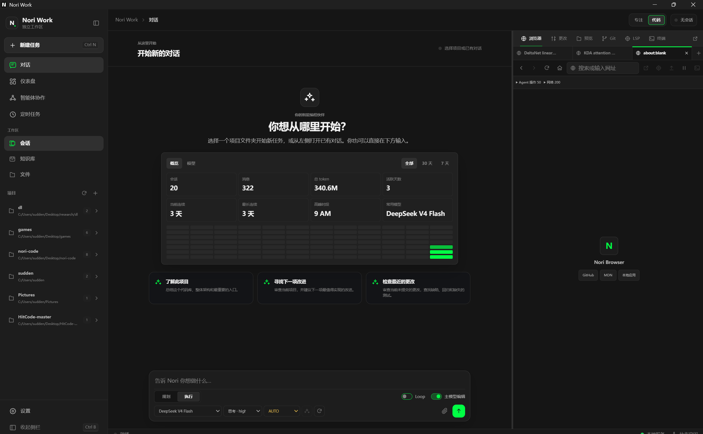

# Nori Work

Nori Work is the Electron desktop workspace for Nori Code. The package name is `@nori-code/nori-work`.



## Architecture

Nori Work combines three existing boundaries instead of duplicating Agent logic:

- The **Electron main process** owns the native window, application menu, updater, project-directory picker, notifications, and server lifecycle.
- The explicit **preload bridge** exposes the small set of approved IPC operations used by the renderer, including server-token lookup and local project file access.
- The bundled **Nori Web renderer** talks to the local Nori REST/WebSocket server for sessions, streaming events, provider settings, Agent activity, knowledge, and Git operations.

The current desktop workspace also includes:

- A persistent `node-pty` terminal connected to the active project.
- LSP diagnostics, hover, definitions, references, symbols, rename, and formatting.
- Reorderable, resizable inspector tools with standalone-window support.
- Project file preview and direct `@path` references to the main Agent.
- Custom Agent roles with explicit read, write, terminal, web, and delegation permissions.
- Background AgentSwarm monitoring and controls for pause, guidance, resume, and stop.
- Configurable completion, Agent, approval, and error notification sounds.

At startup, the desktop process launches or reuses the bundled Nori SEA server, reads `~/.nori-code/server/lock`, obtains its origin and token, and loads the renderer. The shared daemon is left running when the window closes and exits after its idle period when no clients remain.

Key files:

- `src/main/index.ts`: application lifecycle, window, menu, tray, and updater wiring.
- `src/main/ensure-server.ts`: launch/reuse the SEA, read the lock file, and wait for health.
- `src/main/sea-path.ts`: resolve the development or packaged SEA binary.
- `src/main/ipc-handlers.ts`: explicit native IPC handlers.
- `src/main/browser-view.ts`: isolated `WebContentsView` lifecycle for the embedded browser.
- `src/preload/index.ts`: isolated renderer bridge.
- `electron-builder.config.cjs`: installer, platform assets, and signing configuration.

## Development

The desktop development build needs a current Web build and a platform-specific SEA:

```sh
pnpm --filter @nori-code/nori-web build
pnpm -C apps/nori-code build:native:sea
pnpm -C apps/nori-code test:native:smoke
pnpm --filter @nori-code/nori-work dev
```

Run focused checks with:

```sh
pnpm --filter @nori-code/nori-web typecheck
pnpm --filter @nori-code/nori-work typecheck
pnpm check:brand
```

## Packaging

`dist` builds the Electron main/preload code and invokes electron-builder for the current platform. The `before-pack` hook stages both the platform SEA and `apps/nori-web/dist` into application resources.

```sh
pnpm --filter @nori-code/nori-web build
pnpm -C apps/nori-code build:native:sea
pnpm -C apps/nori-code test:native:smoke
pnpm --filter @nori-code/nori-work dist
```

Artifacts are written to `apps/nori-desktop/dist-app/`.

The updater checks GitHub Releases in packaged builds. A usable release therefore requires the matching installer and update metadata to be uploaded together. Local Windows installers are currently unsigned and may trigger Microsoft Defender SmartScreen.

macOS distribution requires a Developer ID Application certificate and Apple notarization. SEA executables are platform-specific, so CI must build each operating system on its native runner.
