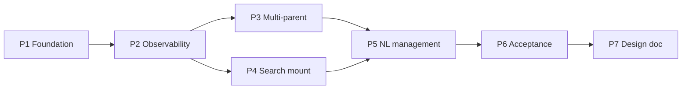

# ADR pre.1: Unified session node graph

**Status:** Accepted (P1 in progress)  
**Date:** 2026-08-28  
**Depends on:** Current mount forest (`parent_session_id`), Conversation Map (nori-web)

## Current status (Session-only members)

Durable collaborators are **Sessions**. Hiring creates and resumes a mounted child Session (`parent_session_id` + identity + cwd). Team Engineering (chat, Discuss, Assign, identity) addresses that session id. Parent-session `kind:'team'` agents are leftover shadows: migrate transcript/chat into the child, then detach. The map, sidebar, `/map`, and `/team` all read the same Session forest.

## Context

The Conversation Map today renders a **mount forest** derived from `parent_session_id` metadata and TeamCreate agent ghosts. Topology is implicit: one parent per child, main-agent privilege in prompts, and unmount/delete conflated in places. Users want a **unified session node graph** where:

- Every node is the same type (a session).
- Relationships are **explicit edges** with types and service context.
- Map storage is the topology source of truth; runtime applies changes after the current agent turn when needed.
- Top-level nodes can self-bootstrap role (permission-gated tool); mounted members cannot.

## Decision summary

Replace implicit mount hierarchy with an **edge-first model** staged in phases P1→P2→P3–P5. P1 lands the schema, local persistence, Map UI wiring, and mount-API sync for parent edges. Later phases add observability, multi-parent hiring, search/mount flows, and NL session management.

### Implementation note (Map MVP, 2026-08)

Shipped in nori-web **without** full edge-first refactor: **server `parent_session_id` + mount API remain source of truth** for parent topology; `SessionMapDoc.edges` seeds from the server graph and syncs parent mounts only. UI uses a single `MapNodeMember` type with `mapNodeCapabilities()` (permissions, not parallel node classes). Peer/service edge types exist in the schema for later phases but are not rendered as a separate graph v2. Top-level self-bootstrap role is gated in UI (`canSelfBootstrapRole`) and stored locally in `topLevelRoles` until agent-core exposes `SessionSelfBootstrap`.

## Unified node model (P1)

| Concern | Storage | Runtime prompt |
| --- | --- | --- |
| **Identity** (name, capability, memory scope) | Session + agent profile | `<session_self>` identity block |
| **Edge service context** (mandate, task, return target) | Edge fields + mount metadata | Current edge mandate + task appended to system prompt |
| **Topology** | Explicit edges (Map doc → server graph) | One-hop neighbors for status/discuss/chat scope |

Rules:

- Remove main-agent privilege; all nodes share one session type.
- System prompt = identity + **active edge** mandate/task (per edge type policy).
- Node delete is a explicit Map user action only; dismiss/unmount **disconnects edges**, not nodes.

## Edge semantics (P1)

```ts
type SessionMapEdgeType = 'parent' | 'peer' | 'service';

interface SessionMapEdge {
  id: string;
  type: SessionMapEdgeType;
  source: string;   // parent / peer A / service client
  target: string;   // child / peer B / service provider
  mandate?: string;
  task?: string;
  returnTo?: string;
  status?: string;
}
```

| Type | Meaning | Mount API sync (P1) | Layout |
| --- | --- | --- | --- |
| `parent` | Organizational mount / department tree | Yes — `parent_session_id` | Tree edges |
| `peer` | Equal collaboration link | Local only (P3+) | Visual link |
| `service` | Task delegation with return target | Local only (P3+) | Visual link |

Scope rules (P1):

- Status, Discuss, and chat routing use **one-hop edges** only (no transitive closure).
- Cycles forbidden for `parent` edges (existing `assertAcyclicMount`).
- Multi-parent (`兼职`) — schema ready; server single-parent until P3.

## Map persistence (P1)

- **Source of truth:** `SessionMapDoc.edges` in localStorage (`nori-session-map-doc`), version 2.
- Positions and annotations remain in the same doc.
- On first load with empty edges, seed from `GET /sessions/graph` parent edges.
- Wire drop creates/updates typed edge; parent edges call `mount` / `remount` / `unmount`.
- **Deferred apply:** if child or parent session is `running`, queue `pendingTopology` and flush when idle.

Future: persist edges on server graph API (same schema).

## Top-level self-bootstrap (P1)

- **Top node:** no incoming `parent` edge and no `parent_session_id` metadata.
- **Member:** has ≥1 incoming `parent` edge or metadata parent.
- Top nodes: enable `SessionSelfBootstrap` tool in permissions (stub in nori-web utils; full tool in agent-core P2).
- When mounted, tool disabled; when unmounted back to top, re-enabled.

## P2 — Observability primitives (stubs)

Read-only queries from Map + session list (no memory taxonomy):

- Edge events — current edge list with status
- Busy — sessions with `status === 'running'`
- Role occupancy — session id → mount_role / parent

Implemented as `queryMapObservability()` in nori-web; agent-queryable tools in agent-core follow.

## P3 — Part-time nodes, busy queue, provenance (planned)

- Multiple concurrent `parent` / `service` edges per node
- Busy queue on service edges
- Note provenance attached to service edges
- Server graph stores full edge set; mount API becomes one writer among many

## P4 — Search and mount modes (planned)

- Keyword / semantic search tool for mount targets
- Temporary vs persistent hire (edge lifetime flags)

## P5 — NL session management (planned)

- Natural-language flow for create / connect / disconnect / delete on the Map

## P6 — Acceptance experiments (planned)

- Scenarios validating one-hop scope, disconnect-not-delete, multi-parent busy behavior

## P7 — ADR chain → design doc (planned)

- Promote this ADR chain into pre.1 product design doc after P1–P2 stabilize

## Dependency chain



## Implementation notes (P1 MVP)

| Area | P1 change |
| --- | --- |
| `sessionMapDoc.ts` | Edge schema, parse v1→v2, seed from server graph |
| `session-graph.ts` | Top-node detection, self-bootstrap flag, observability stub, edge merge |
| `SessionMapPage.tsx` | Wire → typed edge; disconnect vs delete; canvas create session; pending queue |
| `session-mount.ts` | Unchanged cycle/sidebar helpers |
| agent-core | No breaking changes; mount API remains authoritative for parent edges |
| Tests | Edge persist, disconnect-not-delete, top-node self-bootstrap permission |

## Consequences

- **Positive:** Single node type, explicit topology, Map-first UX, path to multi-parent.
- **Negative:** Dual storage (local edges + server metadata) until server graph stores edges.
- **Risk:** Drift between local edges and server mount — mitigated by seed-on-load and mount API on parent wire.

## References

- `packages/agent-core/src/session/mount-metadata.ts`
- `packages/agent-core/src/session/session-self.ts`
- `apps/nori-web/src/components/SessionMapPage.tsx`
- `GET /api/v1/sessions/graph`
